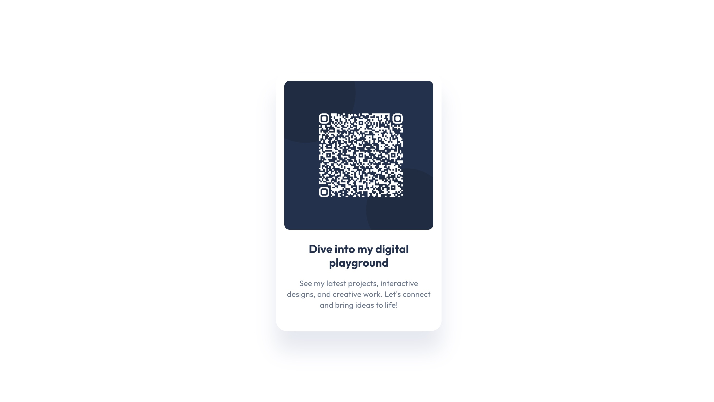
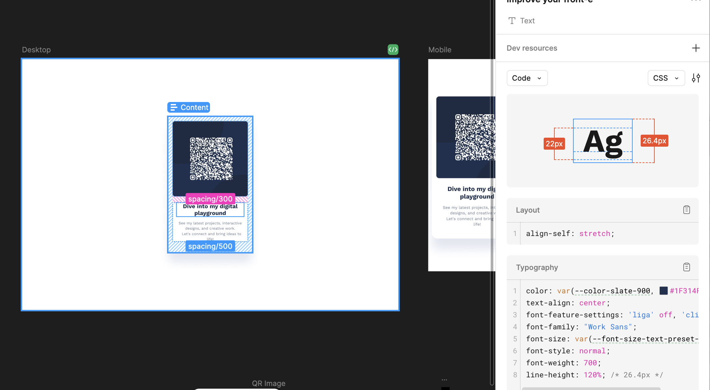

# 📌 QR Code Portfolio Project

🚀 **Live Demo:** [catalina-qr.netlify.app](https://catalina-qr.netlify.app/)

## 📖 About

This project is a **QR code experience** leading to my **portfolio**.  
It was created as a **practice project** to explore **Dev Mode in Figma** and understand how design and development workflows integrate.

## 🛠️ Features

- 🎨 **Custom-designed QR code** for my portfolio.
- 🖥️ **Responsive layout** to ensure proper display across devices.
- 🔍 **Practice project** to experiment with Figma’s Dev Mode.

## 📂 Installation & Usage

Since this is a **static project** using only HTML & CSS, no dependencies are needed.

### 1️⃣ Clone the Repository

```bash
git clone https://github.com/your-username/your-repository.git
cd your-repository
```

### 2️⃣ Open the File

Simply open `index.html` in your browser.

## 🚀 Deployment

This project is deployed on **Netlify**.

## 🖼️ Preview

  
_Scan the QR code to explore my portfolio!_

## 🛠️ Figma Dev Mode

This project was designed and refined using **Figma Dev Mode** to streamline the transition from design to development.

### **Figma Dev Mode Screenshot**

  
\*A look at how Dev Mode in Figma was used to inspect and refine the project.

## 👤 Author

- **Catalina** – https://t.ly/2muu
- **GitHub**: [Your GitHub Profile](https://github.com/your-username)

## 📄 License

This project is licensed under **[License Name]**.
